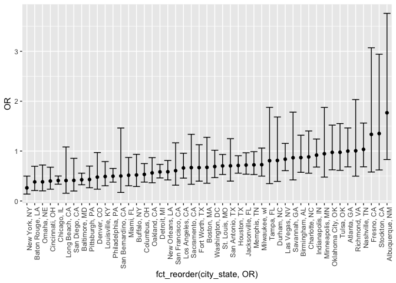
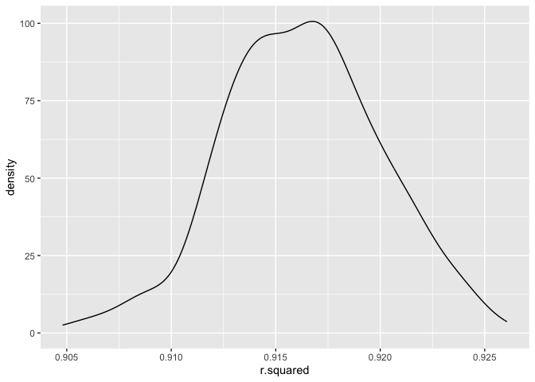
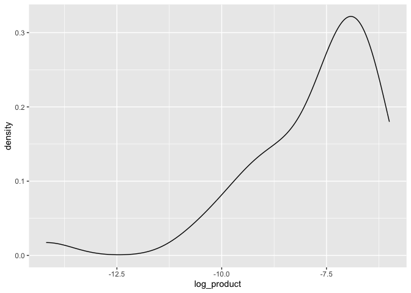
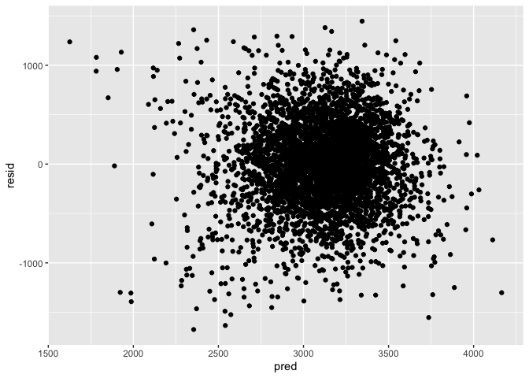
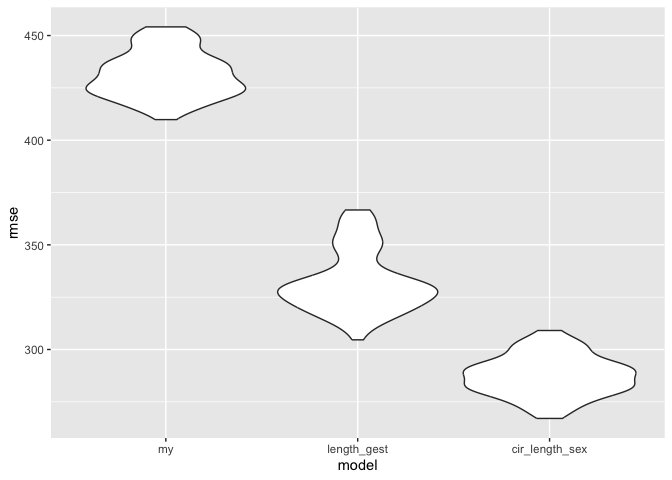

p8105_hw6_jkl2195
================
Jessie Li
2023-11-30

Import libraries

``` r
library(tidyverse)
```

    ## ── Attaching core tidyverse packages ──────────────────────── tidyverse 2.0.0 ──
    ## ✔ dplyr     1.1.3     ✔ readr     2.1.4
    ## ✔ forcats   1.0.0     ✔ stringr   1.5.0
    ## ✔ ggplot2   3.4.3     ✔ tibble    3.2.1
    ## ✔ lubridate 1.9.2     ✔ tidyr     1.3.0
    ## ✔ purrr     1.0.2     
    ## ── Conflicts ────────────────────────────────────────── tidyverse_conflicts() ──
    ## ✖ dplyr::filter() masks stats::filter()
    ## ✖ dplyr::lag()    masks stats::lag()
    ## ℹ Use the conflicted package (<http://conflicted.r-lib.org/>) to force all conflicts to become errors

``` r
library(readr)
library(modelr)
library(mgcv)
```

    ## Loading required package: nlme
    ## 
    ## Attaching package: 'nlme'
    ## 
    ## The following object is masked from 'package:dplyr':
    ## 
    ##     collapse
    ## 
    ## This is mgcv 1.9-0. For overview type 'help("mgcv-package")'.

# Problem 1

``` r
homicide_df = read_csv("data/homicide-data.csv") |>
  mutate(
    city_state = str_c(city, ", ", state),
    solved = ifelse(disposition %in% c("Closed without arrest", "Open/No arrest"),0,1),
    victim_age = as.numeric(victim_age)
  ) |>
  select(-city, -state) |>
  filter(
    !(city_state %in% c("Dallas, TX", "Phoenix, AZ", "Kansas City, MO", "Tulsa, AL")),
    victim_race %in% c("White", "Black"),
    !is.na(victim_age)
  ) |>
  rename_with(.fn = ~ (gsub("victim_", "", .x, fixed = TRUE)), .col = starts_with("victim_"))
```

    ## Rows: 52179 Columns: 12
    ## ── Column specification ────────────────────────────────────────────────────────
    ## Delimiter: ","
    ## chr (9): uid, victim_last, victim_first, victim_race, victim_age, victim_sex...
    ## dbl (3): reported_date, lat, lon
    ## 
    ## ℹ Use `spec()` to retrieve the full column specification for this data.
    ## ℹ Specify the column types or set `show_col_types = FALSE` to quiet this message.

    ## Warning: There was 1 warning in `mutate()`.
    ## ℹ In argument: `victim_age = as.numeric(victim_age)`.
    ## Caused by warning:
    ## ! NAs introduced by coercion

Created a city_state variable that combines city and state variables,
and a binary variable indicating whether the homicide is solved (1 for
solved, 0 for unsolved). Omited cities Dallas, TX; Phoenix, AZ; and
Kansas City, which didn’t report victim race. Tulsa, AL is dropped due
to a data entry mistake. We only focus on white and black race with the
highest data entries. Invalid age are dropped from the dataset.

``` r
solved_glm_obj = homicide_df |>
  filter(city_state == "Baltimore, MD") |>
  glm(solved ~ age + sex + race, family = binomial(), data = _)

solved_glm = solved_glm_obj |>
  broom::tidy() |>
  mutate(
    OR = exp(estimate),
    OR_CI_upper = exp(estimate + 1.96 * std.error),
    OR_CI_lower = exp(estimate - 1.96 * std.error)
  ) |> 
  filter(term == "sexMale") |> 
  select(OR, OR_CI_lower, OR_CI_upper)

solved_glm
```

    ## # A tibble: 1 × 3
    ##      OR OR_CI_lower OR_CI_upper
    ##   <dbl>       <dbl>       <dbl>
    ## 1 0.426       0.325       0.558

For the city of Baltimore, MD, used the glm function to fit a logistic
regression with resolved vs unresolved as the outcome and victim age,
sex and race as predictors. The odds ratio and its confidence interval
are given above.

``` r
solved_city_glm = homicide_df |>
  nest(data = -city_state) |>
  mutate(
    model = map(data, \(df)glm(solved ~ age + sex + race, family = binomial(), data = df)),
    result = map(model, broom::tidy)
  ) |>
  unnest(result) |>
  select(-model,-data) |>
  mutate(
    OR = exp(estimate),
    OR_CI_upper = exp(estimate + 1.96 * std.error),
    OR_CI_lower = exp(estimate - 1.96 * std.error)
  ) |>
  filter(term == "sexMale")

solved_city_glm
```

    ## # A tibble: 47 × 9
    ##    city_state      term  estimate std.error statistic  p.value    OR OR_CI_upper
    ##    <chr>           <chr>    <dbl>     <dbl>     <dbl>    <dbl> <dbl>       <dbl>
    ##  1 Albuquerque, NM sexM…  5.70e-1     0.385  1.48     1.39e- 1 1.77        3.76 
    ##  2 Atlanta, GA     sexM…  7.71e-5     0.194  0.000397 1.00e+ 0 1.00        1.46 
    ##  3 Baltimore, MD   sexM… -8.54e-1     0.138 -6.18     6.26e-10 0.426       0.558
    ##  4 Baton Rouge, LA sexM… -9.64e-1     0.306 -3.15     1.65e- 3 0.381       0.695
    ##  5 Birmingham, AL  sexM… -1.39e-1     0.212 -0.657    5.11e- 1 0.870       1.32 
    ##  6 Boston, MA      sexM… -3.95e-1     0.326 -1.21     2.26e- 1 0.674       1.28 
    ##  7 Buffalo, NY     sexM… -6.53e-1     0.299 -2.18     2.90e- 2 0.521       0.935
    ##  8 Charlotte, NC   sexM… -1.23e-1     0.236 -0.524    6.00e- 1 0.884       1.40 
    ##  9 Chicago, IL     sexM… -8.91e-1     0.102 -8.77     1.86e-18 0.410       0.501
    ## 10 Cincinnati, OH  sexM… -9.17e-1     0.269 -3.41     6.49e- 4 0.400       0.677
    ## # ℹ 37 more rows
    ## # ℹ 1 more variable: OR_CI_lower <dbl>

Applied glm to the entire dataset by nesting. The confidence interval of
the estimation is also given above.

``` r
solved_city_glm |>
  ggplot(aes(x = fct_reorder(city_state, OR), y = OR)) +
  geom_point() +
  geom_errorbar(aes(ymin = OR_CI_lower, ymax = OR_CI_upper)) +
  theme(axis.text.x = element_text(angle = 90, hjust = 1))
```

<!-- -->

This is a plot that shows the estimated ORs and CIs for each city, which
is ordered according to estimated OR.For the cities with higher adjusted
odds ratio, the confidence interval is larger. Most of the cities has a
confidence interval below one.

# Problem 2

``` r
weather_df = 
  rnoaa::meteo_pull_monitors(
    c("USW00094728"),
    var = c("PRCP", "TMIN", "TMAX"), 
    date_min = "2022-01-01",
    date_max = "2022-12-31") |>
  mutate(
    name = recode(id, USW00094728 = "CentralPark_NY"),
    tmin = tmin / 10,
    tmax = tmax / 10) |>
  select(name, id, everything())
```

    ## using cached file: /Users/ya2/Library/Caches/org.R-project.R/R/rnoaa/noaa_ghcnd/USW00094728.dly

    ## date created (size, mb): 2023-09-28 10:23:59.404236 (8.524)

    ## file min/max dates: 1869-01-01 / 2023-09-30

Import weather data using code provided by P8105.

``` r
z_value = qnorm(.975)
tmax_boot_straps = weather_df |>
  mutate(
    strap_sample = map(id, \(i) sample_n(weather_df, size = 5000, replace = TRUE)),
    model = map(strap_sample, \(sample) lm(tmax ~ tmin + prcp, data = sample)),
    result = map(model, broom::tidy),
    glan = map(model, broom::glance)
  ) |>
  unnest(result, glan) |>
  select(date, term, estimate, r.squared) |>
  pivot_wider(
    names_from = term,
    values_from = estimate) |>
  mutate(
      log_product = log(tmin * prcp)
    )
```

    ## Warning: `unnest()` has a new interface. See `?unnest` for details.
    ## ℹ Try `df %>% unnest(c(result, glan))`, with `mutate()` if needed.

    ## Warning: There was 1 warning in `mutate()`.
    ## ℹ In argument: `log_product = log(tmin * prcp)`.
    ## Caused by warning in `log()`:
    ## ! NaNs produced

``` r
r_square_CI_lower = tmax_boot_straps |> pull(r.squared) |> quantile(.025)
r_square_CI_upper = tmax_boot_straps |> pull(r.squared) |> quantile(.975)

log_CI_lower = tmax_boot_straps |> na.omit(log_product) |> pull(log_product) |> quantile(.025)
log_CI_upper = tmax_boot_straps |> na.omit(log_product) |> pull(log_product) |> quantile(.975)
```

Used bootstrap 5000 times to create 5000 linear models. The model
predicted maximum temperature using the minimum temperature and
precipation as predictors. Out of the 5000 model, the 95% confidence
interval of R square is (0.908717, 0.9236437), and the 95% confidence
interval of log of the product of two coefficients is (-11.1268746,
-6.2118626). The following shows the plots of R square and log product
of coefficients of the bootstrap samples.

``` r
tmax_boot_straps |>
  ggplot(aes(x = r.squared)) +
  geom_density()
```

<!-- -->

``` r
tmax_boot_straps |>
  na.omit(log_product) |>
  ggplot(aes(x = log_product)) +
  geom_density()
```

<!-- -->
The plot for r square shows approximately normal distribution with mean
around 0.916, validating the model as it is almost 1. The plot for the
log product shows a right skewed distribution with median between -8 and
-7.

# Problem 3

``` r
birth_df = read_csv("data/birthweight.csv") |>
  na.omit() |>
  mutate(
    babysex = recode(babysex, `1` = "male", `2` = "female"),
    babysex = factor(babysex),
    frace = recode(frace, `1` = "White", `2` = "Black", `3` = "Asian", `4` = "Puerto Rican", `8` = "Other", `9` = "Unknown"),
    frace = factor(frace),
    mrace = recode(mrace, `1` = "White", `2` = "Black", `3` = "Asian", `4` = "Puerto Rican", `8` = "Other", `9` = "Unknown"),
    mrace = factor(mrace),
    malform = recode(malform, `0` = "absent", `1` = "present"),
    malform = factor(malform)
  )
```

    ## Rows: 4342 Columns: 20
    ## ── Column specification ────────────────────────────────────────────────────────
    ## Delimiter: ","
    ## dbl (20): babysex, bhead, blength, bwt, delwt, fincome, frace, gaweeks, malf...
    ## 
    ## ℹ Use `spec()` to retrieve the full column specification for this data.
    ## ℹ Specify the column types or set `show_col_types = FALSE` to quiet this message.

Loaded and cleaned the birth weight data. This dataset contains 4342
observations and 20 variables. Notable variables includes baby’s birth
weight, race of the parents, mother’s weight, previous history of
births, baby’s head circumference and smoking status. The categorical
variables such as baby’s sex, parent’s race, etc. is recoded and
factored to the corresponding value. NA values are dropped from the
dataset.

``` r
full_model = lm(bwt ~., data = birth_df)
models = c()
predictor_list = data_frame(predictor = character(), p_value = double(), id = integer())
```

    ## Warning: `data_frame()` was deprecated in tibble 1.1.0.
    ## ℹ Please use `tibble()` instead.
    ## This warning is displayed once every 8 hours.
    ## Call `lifecycle::last_lifecycle_warnings()` to see where this warning was
    ## generated.

``` r
predictor = birth_df |>
  select(-bwt) |>
  colnames()

# Forward Selection
join_predictors = function(predictor_list){
  string = ''
  for(i in predictor_list){
    if(string == ''){
      string = str_c(i, " + ")
    } else{
      string = str_c(string, i, " + ")
    }
  }
  return(string)
}


generate_predictors = function(dependent, predictor_list, model_df, data_df, iter){
  value = model_df |>
    filter(length(predictor_list |> pull(predictor)) == 0 |
             !(predictor %in%  pull(predictor_list, predictor))) |>
    mutate(
      model = 
        map(predictor, \(col) paste(dependent, 
                                     ' ~ ', 
                                     predictor_list |>
                                       pull(predictor) |>
                                       join_predictors(),
                                     col)) |>
        map(as.formula) |>
        map(lm, data = data_df),
      results = map(model, broom::glance)
    ) |>
    unnest(results) |>
    na.omit(p.value) |>
    filter(p.value != 0) |>
    filter(p.value == min(p.value)) |>
    select(predictor, model, p.value)
  bind_rows(predictor_list, data_frame(predictor = value |> pull(predictor), 
                                       model = value |> pull(model),
                                       p_value = value |> pull(p.value), 
                                       id = iter))
}

model_df = predictor |>
  data_frame()

for(i in 1:4){
  predictor_list = generate_predictors(dependent = 'bwt', predictor_list, model_df, data_df = birth_df, i)
}

#lm(btw ~ Bloodclot, data = surg)
#summary(fit1)
```

By forward selection process of 4 variables, we have selected the
following predictors: \`r paste(pull(predictor_list, predictor)). The
forward selection stops when it reaches 4 variables. For each time, the
variable is selected and tested for the most significant p.value. Then
the variable is added to model and test for the next variable.

``` r
final_model = predictor_list |>
  filter(id == max(id)) |>
  pull(model) |>
  nth(1)

pred = modelr::add_predictions(data = birth_df, model = final_model)
pred = modelr::add_residuals(data = pred, model = final_model)

pred |>
  ggplot(aes(y = resid, x = pred)) +
  geom_point()
```

<!-- -->
The above plot depicts a relationship between residuals and prediction
of the linear model. Ideally, the scores should be randomly distributed
on both sides of residual = 0. This case, the points are evenly spread
on both sides of the axis, but it seems to have a concentration around
residual = 0 and prediction = 3000.

``` r
cv_df = 
  crossv_mc(birth_df, 100) |> 
  mutate(
    train = map(train, as_tibble),
    test = map(test, as_tibble)) |>
  mutate(
    my_lm = map(train, \(df) lm(bwt ~ gaweeks + delwt + mrace + ppbmi, data = df)),
    length_gest_lm = map(train, \(df) lm(bwt ~ blength + gaweeks, data = birth_df)),
    cir_length_sex_lm = map(train, \(df) lm(bwt ~ bhead + blength + babysex + bhead * blength + blength * babysex + bhead * babysex + bhead * blength * babysex, data = birth_df)),
    rmse_my = map2_dbl(my_lm, test, \(mod, df) rmse(model = mod, data = df)),
    rmse_length_gest = map2_dbl(length_gest_lm, test, \(mod, df) rmse(model = mod, data = df)),
    rmse_cir_length_sex = map2_dbl(cir_length_sex_lm, test, \(mod, df) rmse(model = mod, data = df))
  )

cv_df |> 
  select(starts_with("rmse")) |> 
  pivot_longer(
    everything(),
    names_to = "model", 
    values_to = "rmse",
    names_prefix = "rmse_") |> 
  mutate(model = fct_inorder(model)) |> 
  ggplot(aes(x = model, y = rmse)) + geom_violin()
```

<!-- -->

We tested our model against two other proposed models given by P8105: -
(Model 2) One using length at birth and gestational age as predictors
(main effects only) - (Model 3) One using head circumference, length,
sex, and all interactions (including the three-way interaction)

Model 3 has the best root mean squared error compared to all other
models with range between 250 and 325. This is followed by model 2 with
range 300 and 375. My model has a root square mean error between 400 and
475. This could be due to lack of interacting term in my model.
